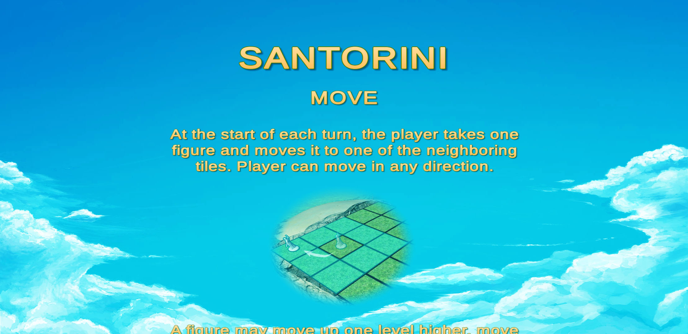
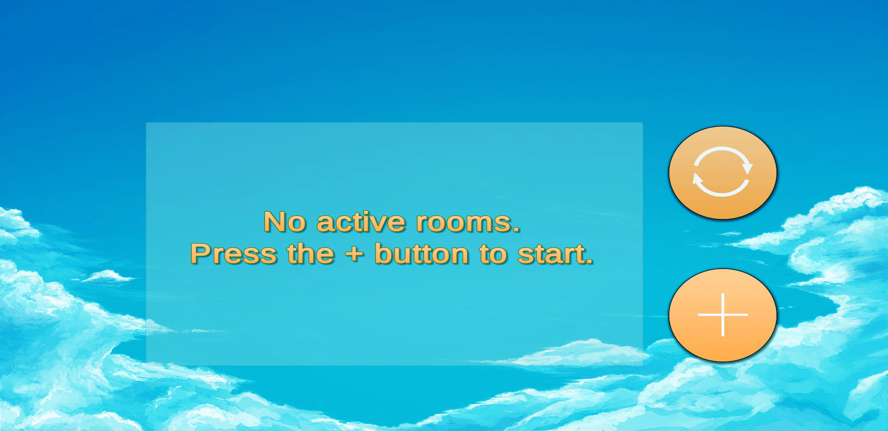

# 
 Santorini Board Game

## Summary
&nbsp;&nbsp;&nbsp;&nbsp;&nbsp;&nbsp;Santorini board game is made in Unity Game Engine with support for Android OS. Game implements playing on same phone, playing over same Wifi or playing versus AI. This version of Santorini board game is implemented without Greek Gods feature. UNet was used for communication over Wifi. 
   
&nbsp;&nbsp;&nbsp;&nbsp;&nbsp;&nbsp;AI was created with Minimax algorithm with Alpha-Beta pruning, while goal is for AI to be trained with Deep Reinforcement Learning algorithms which is currently being developed. Current AI has only one level of difficulty which will be improved to three or four.
  

## Tutorial  

## Game design
&nbsp;&nbsp;&nbsp;&nbsp;&nbsp;&nbsp;Most of 3d models (island, rocks, building, shark, crab etc.) were created in Blender, while few were imported from Unity Asset Store. Animations are from both Blender and Unity.

## Connecting over Wifi
&nbsp;&nbsp;&nbsp;&nbsp;&nbsp;&nbsp;Game can be played over the same Wifi network where first player creates room with unique ID and acts like server, while second player finds room number in list of all available rooms.

Video:

## Improving game - TODO
* Improving water shader
* Adding 3d model of birds with sounds
* Adding night theme with torches
* Advanced tutorial for tactics
* Model animation on touch
* Improving 3d model of rocks
* Some QoL features

